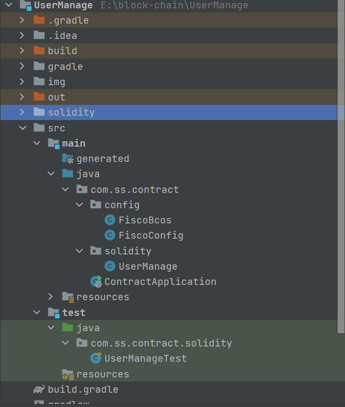
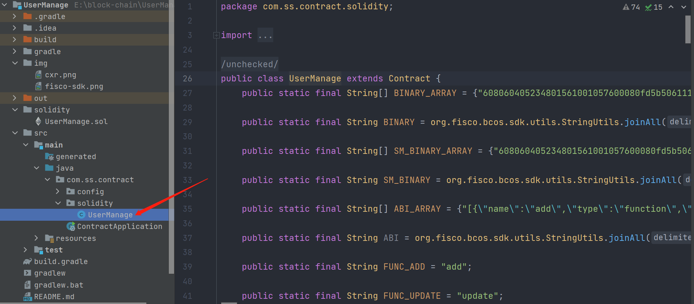
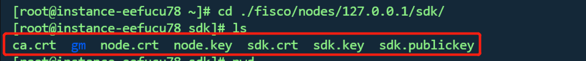
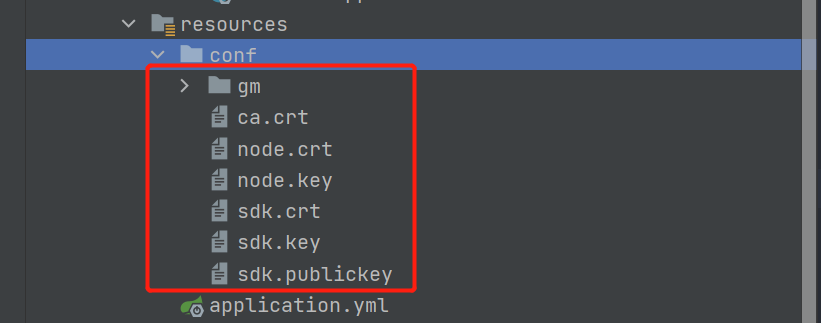

# FISCO BCOS 的Java-Sdk使用入门
使用SpringBoot在FISCO BCOS部署合约、调用合约。项目结构如下:

## 准备solidity合约

编写好的合约在项目solidity目录下
代码如下：
~~~solidity
pragma solidity ^0.5.1;

contract UserManage {

    struct User {

        uint256 id;

        string name;

        string sex;
    }

    mapping(uint256 => User) users;

    uint256[] ids;
    
    modifier notExist(){

        bool exist = isExist(uint256(msg.sender));
        require(!exist, "User already exist");
        _;
    }

    /**
     * 新增user
     */
    function add(string memory name, string memory sex) public notExist returns(uint256, string memory, string memory) {

        uint256 id = uint256(msg.sender);
        User memory user = User(id, name, sex);
        ids.push(id);
        users[id] = user;
        return (users[id].id, users[id].name, users[id].sex);
    }

    /**
     * 更新User
     *
     */
    function update(string memory name, string memory sex) public returns(uint256, string memory, string memory) {

        bool exist = isExist(uint256(msg.sender));
        require(exist, "User not exist");

        uint256 id = uint256(msg.sender);
        User memory user = User(id, name, sex);
        users[id] = user;
        return (users[id].id, users[id].name, users[id].sex);
    }

    /**
     * 删除User
     *
     */
    function del(uint256 id) public {

        uint8 index = 0;
        bool exist = false;
        for (uint8 i = 0; i < ids.length; i++){

            if (uint256(msg.sender) == ids[i]){
                exist = true;
                index = i;
                break;
            }
        }

        require(exist, "User not exist");
        delete ids[index];
        delete users[id];
    }

    /**
     * 查询User
     *
     */
    function get(uint256 id) public view returns(uint256, string memory, string memory){

        return (users[id].id, users[id].name, users[id].sex);
    }

    /**
     * 用户是否存在
     *
     */
    function isExist(uint256 id) private view  returns(bool){

        bool exist = false;
        for (uint8 i = 0; i < ids.length; i++){

            if (uint256(id) == ids[i]){
                exist = true;
                break;
            }
        }
        return exist;
    }

    function test() public pure returns(string memory){

        return "hello world";
    }
}
~~~

编译solidity合约，并生成调用合约的Java类，本项目中生成的合约调用类是solidity包下的UseManage类


## 编写配置文件
1. 复制证书和密钥
   在程序resource目录下新建conf文件夹，并将FISCO BCOS链中./fisco/nodes/127.0.0.1/sdk/路径下的证书和密钥文件复制到conf文件夹下
   
      
   
2. 在application.yml中编写连接FISCO BCOS的配置:
~~~yaml
fisco:
  cryptoMaterial:
    certPath: "conf"
  #  caCert: "conf/ca.crt"
  #  sslCert: "conf/sdk.crt"
  #  sslKey: "conf/sdk.key"
  #  enSslCert: "conf/gm/gmensdk.crt"
  #  enSslKey: "conf/gm/gmensdk.key"

  network:
    peers:
      - "106.12.*.*:20201"
      - "106.12.*.*:20200"

  amop:
  #  - publicKeys: [ "conf/amop/consumer_public_key_1.pem" ]
  #    topicName: "PrivateTopic1"
  #  - password: "123456"
  #    privateKey: "conf/amop/consumer_private_key.p12"
  #    topicName: "PrivateTopic2"

  account:
    keyStoreDir: "account"
    #  accountFilePath: "conf"
    accountFileFormat: "pem"
  #  accountAddress: "0x"
  #  password: ""

  threadPool:
  #  channelProcessorThreadSize: "16"
  #  receiptProcessorThreadSize: "16"
    maxBlockingQueueSize: "102400"
~~~

3. 编写Java配置
新建FiscoConfig类用以读取yml中的配置
```java
@Data
@ToString
@Component
@ConfigurationProperties(prefix = "fisco")
public class FiscoConfig {

    private Map<String, Object> cryptoMaterial;
    public Map<String, List<String>> network;
    public List<AmopTopic> amop;
    public Map<String, Object> account;
    public Map<String, Object> threadPool;
}
```
新建FiscoBcos类，初始化BcosSDK
~~~java
@Slf4j
@Data
@Component
public class FiscoBcos {

    @Autowired
    private FiscoConfig fiscoConfig;

    private BcosSDK bcosSDK;

    @PostConstruct
    public void init() {
        ConfigProperty configProperty = loadProperty();
        try {
            ConfigOption configOption = new ConfigOption(configProperty, CryptoType.ECDSA_TYPE);
            bcosSDK = new BcosSDK(configOption);
        } catch (ConfigException e) {
            log.error("init error: {}", e);
        }
    }

    private ConfigProperty loadProperty() {

        ConfigProperty configProperty = new ConfigProperty();
        configProperty.setCryptoMaterial(fiscoConfig.getCryptoMaterial());
        configProperty.setAccount(fiscoConfig.getAccount());
        Map network = fiscoConfig.getNetwork();
        configProperty.setNetwork(network);
        configProperty.setAmop(fiscoConfig.getAmop());
        configProperty.setThreadPool(fiscoConfig.getThreadPool());
        return configProperty;
    }
}
~~~
## 测试
编写测试类，调用UserMange中的方法，完成合约的部署以及调用和约的方法

~~~java
@Slf4j
@RunWith(SpringRunner.class)
@SpringBootTest
public class UserManageTest {

    @Autowired
    private FiscoBcos fiscoBcos;

    @Test
    public void testClient() throws ContractException, ABICodecException, TransactionException, IOException {

        BcosSDK bcosSDK = fiscoBcos.getBcosSDK();
        Client client = bcosSDK.getClient(Integer.valueOf(1));

        // 获取区块号
        BlockNumber blockNumber = client.getBlockNumber();
        log.info("blockNumber: {}", blockNumber);

        CryptoKeyPair cryptoKeyPair = client.getCryptoSuite().getCryptoKeyPair();

        // 部署合约
        UserManage userManage = UserManage.deploy(client, cryptoKeyPair);
        String contractAddress = userManage.getContractAddress();
        log.info("contractAddress: {}", contractAddress);

        // 调用合约test方法
        String test = userManage.test();
        log.info("test: {}", test);

        // 调用合约add方法，并获得交易回执
        TransactionReceipt receipt = userManage.add("Alice", "nv");
        log.info("TransactionReceipt: {}", receipt.toString());
        // 获取当前群组对应的密码套件接口
        CryptoSuite cryptoSuite = client.getCryptoSuite();
        // 构造TransactionDecoderService实例，传入是否密钥类型参数。
        TransactionDecoderInterface decoder = new TransactionDecoderService(cryptoSuite);
        // 解码交易回执
        TransactionResponse transactionResponse = decoder.decodeReceiptWithValues(UserManage.ABI, "add", receipt);
        // 交易的output信息
        log.info("TransactionResponse: {}", transactionResponse.getReturnObject());
        BigInteger id = (BigInteger) transactionResponse.getReturnObject().get(0);

        Tuple3<BigInteger, String, String> tuple3 = userManage.get(id);
        log.info("id: {}, name: {}, sex: {}", tuple3.getValue1(), tuple3.getValue2(), tuple3.getValue3());
    }
}
~~~

